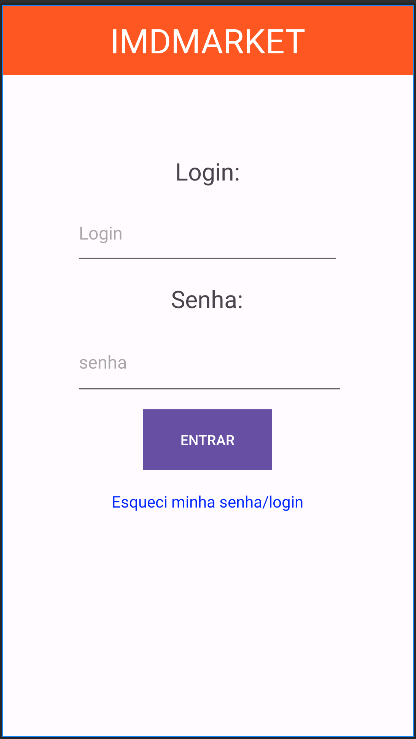
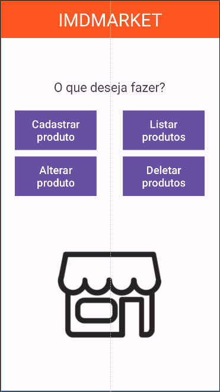
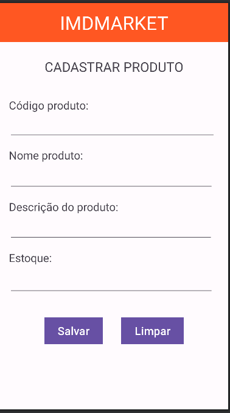
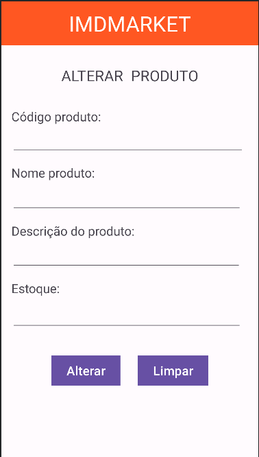
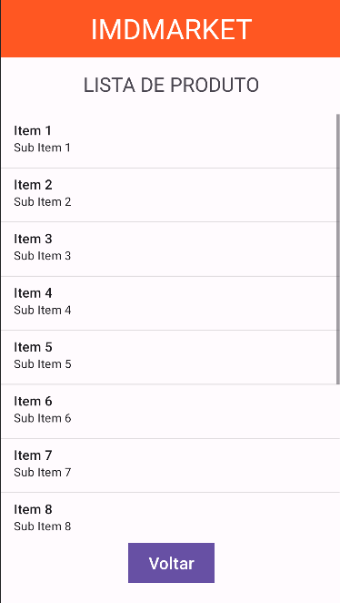

<h1 align = "center">
  IMD Market
  

    
    
  

</h1>

<a href= "#sobre-este-projeto">🕹️ Sobre este projeto</a> &nbsp;&nbsp;&nbsp;|&nbsp;&nbsp;&nbsp;
<a href="#consideracoes">🎮 Considerações</a> &nbsp;&nbsp;&nbsp;|&nbsp;&nbsp;&nbsp;
<a href="#leitura">🏴‍☠️ Leitura e links recomendados</a> &nbsp;&nbsp;&nbsp;|&nbsp;&nbsp;&nbsp;
<a href="#licenca">📝 Licença</a>

<h2 id = "sobre-este-projeto">🕹️ Sobre este projeto</h2>

Projeto da disciplina de Desemvolvimento para Dispositivos Móveis com a proposta de simular um gerenciador de estoques de produtos de um supermercado.

O projeto é desenvolvido utilizando a linguagem Kotlin e o framework Jetpack Compose, possuindo inicialmente 6 telas para o gerenciamento e visualização de produtos.

<h4 style="text-align: center; font-weight: bold;">Imagens do aplicativo</h4>

  
  
  
  
  
  

<h2 id="consideracoes">🎮 Considerações</h2>
Eu já possuía um certo conhecimento com desenvolvimento mobile, porém apenas com Flutter, que é minha atual ferramenta de trabalho. Esse é meu primeiro projeto utilizando JetPack Compose, por isso pretendo utiliza-lo para experimentar os recursos disponíveis.

<h2 id="leitura">🏴‍☠️ Leitura e links recomendados</h2>

* [Jetpack Compose](https://developer.android.com/compose)
* [Kotlin Fundamentals](https://developer.android.com/courses/kotlin-fundamentals/unit-1)
* [Kotlin and Android](https://developer.android.com/kotlin)

<h2 id="licenca">📝 Licença</h2>

- Este projeto está sob a licença [MIT](https://github.com/Arco-de-Treinamento/Shishin-no-Ken/blob/main/LICENSE).

  
  👋🏾 Feito por [JosManoel](https://github.com/JosManoel) com 🕹️ , 🎧 e 💻.

 
